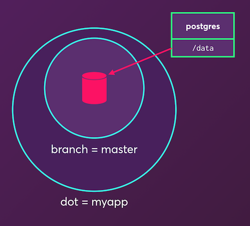

# dotmesh: git for data

Dotmesh is a git-like CLI for capturing, organizing and sharing application states.
The application states that dotmesh captured are stored in datadots.

## installing on docker (Mac or Ubuntu 16.04+)

Install the dotmesh client `dm`:

```plain
sudo curl -sSL -o /usr/local/bin/dm \
    https://get.dotmesh.io/$(uname -s)/dm
```

Make the client binary executable.
```plain
sudo chmod +x /usr/local/bin/dm
```

Then use the client to install `dotmesh-server`, assuming you have Docker installed and your user account has access to the Docker daemon.

```plain
dm cluster init
```

```plain
Checking suitable Docker is installed... yes, got 17.12.0-ce.
Checking dotmesh isn't running... done.
Pulling dotmesh-server docker image...
[...]
```

This will set up a single-instance cluster on your local machine.

Verify that the `dm` client can talk to the `dotmesh-server`:
```
dm version
```

If the installation fails, please [report an issue](https://github.com/dotmesh-io/dotmesh).
You can also experiment in our [online learning environment](https://docs.dotmesh.com/install-setup/katacoda/).
Thanks!

See [the installation docs](https://docs.dotmesh.com/install-setup/) for more details, including installing dotmesh on Kubernetes.


## getting started guide

Try our [hosted tutorial](https://dotmesh.com/try-dotmesh/)!

Alternatively, try the [hello Dotmesh on Docker](https://docs.dotmesh.com/tutorials/hello-dotmesh-docker/) guided tutorial.

## what is a datadot?

A Datadot allows you to capture your application's state and treat it like a `git` repo.

A simple example is to start a PostgreSQL container using a Datadot called `myapp`:

```bash
docker run -d --volume-driver dm \
    -v myapp:/var/lib/postgresql/data --name postgres postgres:9.6.6
```

This creates a datadot called `myapp`, creates the writeable filesystem for the default `master` branch in that datadot, mounts the writeable filesystem for the `master` branch into `/var/lib/postgresql/data` in the `postgres` container, and starts the `postgres` container, like this:



First, switch to it, which, like `cd`'ing into a git repo, makes it the "current" dot -- the dot which later `dm` commands will operate on by default:

```bash
dm switch myapp
```

You can then see the `dm list` output:

```bash
dm list
```

```plain
  DOT      BRANCH  SERVER   CONTAINERS  SIZE       COMMITS  DIRTY
* myapp    master  a1b2c3d  /postgres   40.82 MiB  0        40.82 MiB
```
The current branch is shown in the `BRANCH` column and the current dot is marked with a `*` in the `dm list` output.

## what's next?

* Learn more in the [concept docs](https://docs.dotmesh.com/concepts/what-is-a-datadot/).
* Try another [tutorial](https://docs.dotmesh.com/tutorials/).
